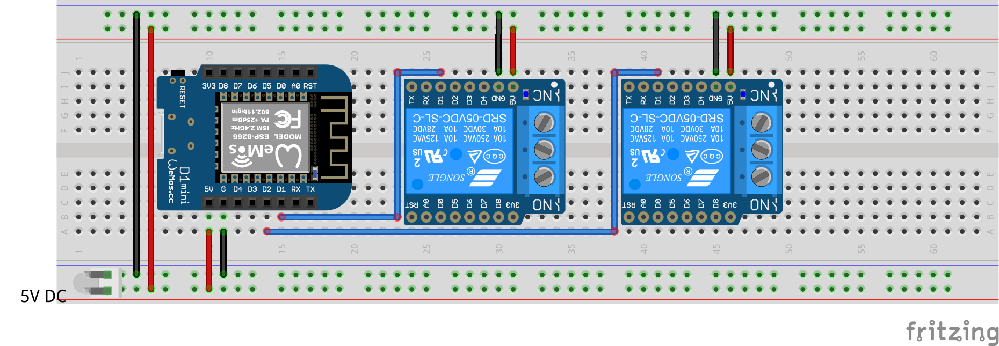

# ZenSwitch Demo 
## Overview
This is a [Mongoose-OS](https://mongoose-os.com/) demo firmware for using ZenSwitches. This firmware uses the native [zswitch](https://github.com/zendiy-mgos/zswitch) library.
## GET STARTED
Build up your device in few minutes just downloading, compiling and flashing this demo.

Clone the repo:
```bash
$ git clone https://github.com/zendiy-mgos/zswitch-demo my-zswitch-demo
$ cd my-zswitch-demo
```
Enable JavaScript demo (skip to continue with C/C++ demo) :
```yaml
sources:
# - src
  - src_js
libs:
  - origin: https://github.com/mongoose-os-libs/mjs
  - ...
```
Build the binary:
```bash
$ mos build --platform <device_platform>
```
Flash the firmware:
```bash
$ mos flash --port <port_name>
```
## Hardware
### Used components
 - Wemos D1 mini board
 - Wemos relay shield (2x)
 - 5V DC power supply (via min-USB cable or via external power supply)
### Wiring schema

## Additional resources
Take a look to some other demo samples.

|Sample|Notes|
|--|--|
|[zswitch-gpio-demo](https://github.com/zendiy-mgos/zswitch-gpio-demo)|Mongoose OS demo firmware for using GPIO-enabled ZenSwitches.|
|[zswitch-mqtt-demo](https://github.com/zendiy-mgos/zswitch-mqtt-demo)|Mongoose OS demo firmware for using MQTT to drive ZenSwitches.|
